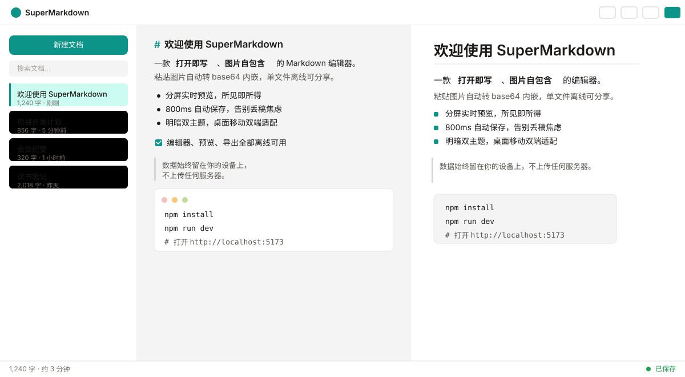
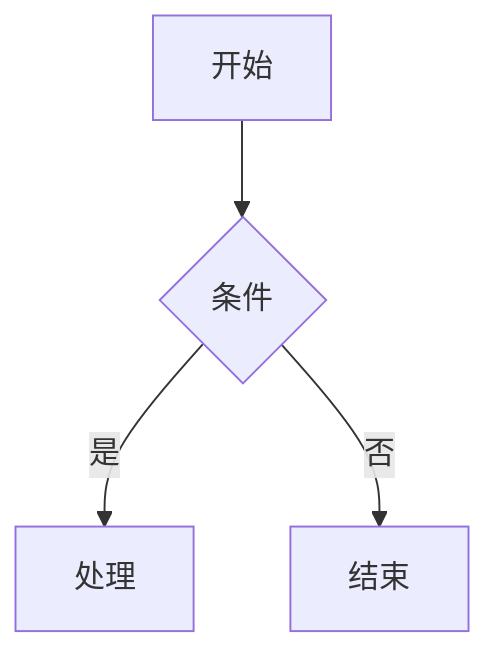
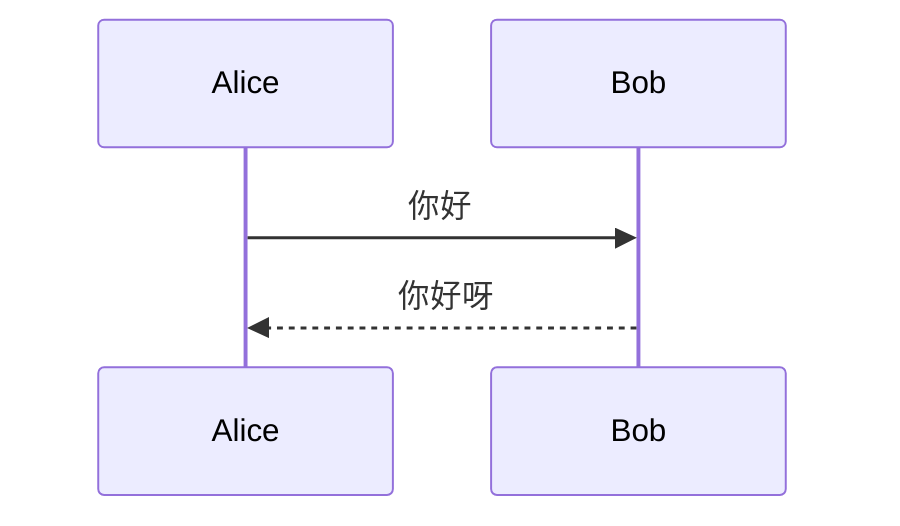
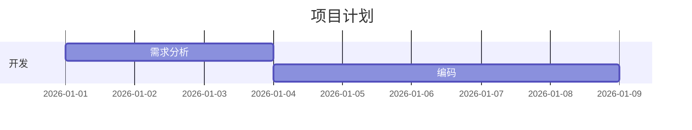
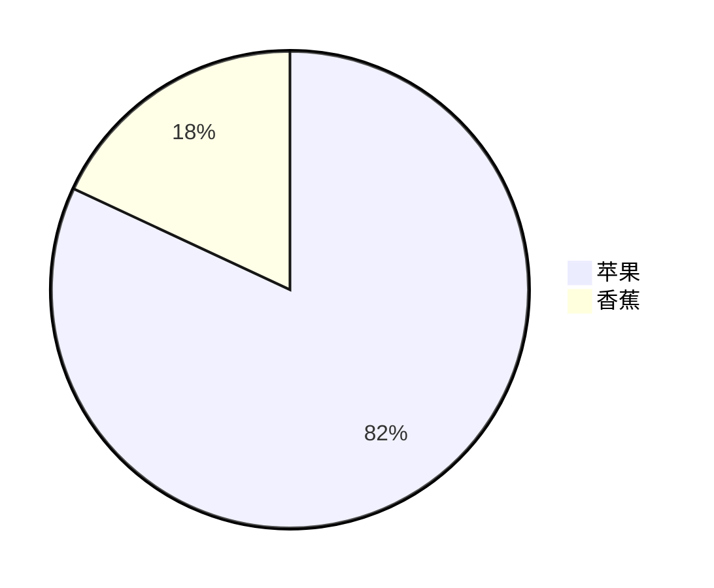

<div align="center">

# SuperMarkdown

**打开即写、图片自包含、数据留在本地的所见即所得 Markdown 编辑器**

<p>
  <a href="https://github.com/riceshowerX/SuperMarkdown/blob/main/LICENSE"></a>
  
  
  
  
</p>

<p>
  <em>免费可及 · 本地优先 · 开箱即用 · Web + Electron 双形态</em>
</p>

</div>

---

## 产品预览



---

## 解决的痛点

| 痛点 | SuperMarkdown 的解法 |
|------|---------------------|
| **图片管理麻烦**——删除残留、依赖图床、分享丢图 | 粘贴/拖拽图片自动转 **base64 内嵌**，单文件自包含、删除即干净、分享不丢图 |
| **写作工具上手成本高**——配置焦虑、学习曲线陡 | 打开即写、所见即所得、零配置 |
| **必须安装或注册**——无法随用随走 | **Web 免安装免注册**，数据存浏览器本地 |
| **移动端体验差**——光标跳动、键盘消失、预览失效 | **响应式布局**，手机/平板直接可用，触控 ≥44px |
| **数据被锁定**——专有格式、数据在云端不可控 | 数据主权在本地 IndexedDB，导出标准 .md / .html |
| **付费门槛**——买断或订阅 | **完全免费**（MIT License） |

---

## 功能亮点

| 模块 | 能力 |
|------|------|
| **所见即所得编辑器** | 编辑区与预览区并排实时渲染（300ms 防抖）；支持 H1-H6、列表、任务列表、粗体、斜体、链接、图片、代码块、表格、引用、删除线 |
| **多文档管理** | 新建 / 打开 / 重命名 / 删除（确认框 + 切相邻）/ 搜索实时过滤；IndexedDB 持久化，按最近修改降序 |
| **自动保存** | 800ms 防抖自动写入；状态栏三态（保存中 / 已保存 / 保存失败 + 重试）；刷新关闭不丢稿；失败保留内存副本 + 自动重试 |
| **图片自包含** | 粘贴 / 拖拽自动压缩转 base64（≤5MB，>1920px 自动压缩），单文件离线可分享 |
| **导出** | HTML（内联样式 + 内嵌图片，离线可打开）与纯文本（去除语法标记）；文件名 `标题-时间戳.html/.txt` |
| **明暗双主题** | 一键切换（150ms 过渡）；偏好持久化；首次跟随系统；挂载前初始化防闪烁 |
| **响应式布局** | 桌面三栏（侧边栏可折叠 + 编辑/预览 50/50 可拖拽）；移动端单栏 Tab + 抽屉 + 底部工具栏 |
| **格式工具栏** | 14 个高频操作：加粗 / 斜体 / 行内代码 / 链接 / H1-H3 / 引用 / 代码块 / 三类列表 / 表格 / 分隔线 / 图片 |
| **图形与公式** | Mermaid 流程图 / 序列图 / 甘特图 / 饼图（` ```mermaid ` 代码块自动渲染为 SVG，明暗主题跟随）；LaTeX 数学公式（`$...$` 行内 / `$$...$$` 块级，KaTeX 渲染） |

**安全设计**：三层 XSS 防线（markdown-it `html:false` → DOMPurify 白名单 → 严格 CSP），任意输入不执行脚本；禁 eval / new Function。

---

## 快速开始

环境要求：**Node.js ≥ 22.12**（已在 v22.22.2 验证）

```bash
git clone https://github.com/riceshowerX/SuperMarkdown.git
cd SuperMarkdown
npm install        # 安装依赖
npm run dev        # 开发服务器 → http://localhost:5173
```

生产构建与测试：

```bash
npm run build      # 产物输出到 dist/
npm run preview    # 本地预览生产构建
npm run test       # Vitest 单元测试（108+ 用例全绿）
```

---

## 图形与公式

Mermaid 与 LaTeX 全面支持，编辑区输入即可实时渲染。

**Mermaid 流程图 / 序列图 / 甘特图 / 饼图**（```` ```mermaid ```` 代码块）：

````markdown







````

**LaTeX 数学公式**（`$...$` 行内 / `$$...$$` 块级）：

```markdown
行内公式 $E=mc^2$ 与块级公式：

$$\int_0^1 x\,dx = \frac{1}{2}$$
```

---

## 技术栈

| 类别 | 技术 | 版本 |
|------|------|------|
| 构建 | Vite + TypeScript | ^7.1.0 / ^5.8.0 |
| 框架 | React + zustand | ^19.2.0 / ^5.0.6 |
| 解析 | markdown-it + markdown-it-task-lists | ^14.1.0 / ^2.1.1 |
| 图形 | Mermaid（流程图/序列图/甘特图/饼图） | ^11.16.1 |
| 公式 | KaTeX + @vscode/markdown-it-katex | ^0.18.4 / ^1.1.2 |
| 安全 | DOMPurify | ^3.2.7 |
| 高亮 | highlight.js | ^11.11.1 |
| 存储 | Dexie（IndexedDB） | ^4.0.0 |
| 图标 | lucide-react | ^0.544.0 |
| 样式 | Tailwind CSS | ^4.1.0 |
| 测试 | Vitest + Testing Library | ^3.2.0 / ^16.0.0 |

---

## 项目结构

```
SuperMarkdown/
├── index.html                  # 入口 HTML（含严格 CSP meta）
├── package.json
├── vite.config.ts              # Vite 7 + Tailwind 4 + Vitest 装配
├── assets/                     # 文档资源（preview.svg 等）
├── docs/design/                # 设计源（MASTER 全局规范 / PAGES 页面提示词）
└── src/
    ├── main.tsx                # 入口：主题初始化防闪烁 + 装配（21 行）
    ├── app/                    # 根组件（38 行）
    ├── components/             # layout / sidebar / editor / preview / toolbar / common
    ├── services/               # markdown / storage / export / clipboard / stats
    ├── stores/                 # documents / editor / ui（zustand）
    ├── hooks/                  # useAutoSave / useTheme / usePasteImage ...
    ├── styles/                 # design-tokens.css（设计 Token）/ preview.css
    ├── types/ utils/ config/   # 模型 / 纯工具 / 常量
    └── __tests__/              # 11 个测试文件（73+ 用例）
```

**架构约定**：单文件 ≤ 300 行（入口 < 100）；依赖只向下；Service 不 import React；组件不直接触碰 IndexedDB；图标全部 lucide-react 具名导入；颜色全部引用设计 Token。

---

## 质量保证

- **QA 独立验收**：18 条 EARS 验收标准全部通过（P0 缺陷归零）
- **测试覆盖**：73+ 用例全绿，含 XSS 深度回归（`javascript:` 链接 / 双重编码注入 / data URL 拒载）、自动保存竞态、图片 5MB 边界、删除切换相邻文档、存储降级往返
- **P0 合规**：无 emoji 图标（全 lucide-react SVG）、无紫粉渐变、无空洞占位文案、无硬编码色值

---

## 路线图

| 版本 | 阶段 | 规划 |
|------|------|------|
| **v1.1** | 打磨期 | 触控 44px 收尾 · 构建 code-split · 分屏滚动同步 · 快捷键面板 · 导入 .md |
| **v1.2** | 桌面双形态 | Electron 38 封装（NSIS 安装包）· 打开本地 .md · 导出 PDF · 自动更新 |
| **v2.0** | 扩展期 | Tauri 2 瘦身（<10MB）· 移动端 PWA · 云同步（评估）· 主题/插件 |

---

## 贡献指南

1. Fork 本仓库并创建功能分支（`git checkout -b feat/xxx`）
2. 提交变更（`git commit -am 'feat: add xxx'`）
3. 推送分支（`git push origin feat/xxx`）
4. 发起 Pull Request

开发前请阅读 `docs/design/MASTER.md`（设计规范）与架构约定；所有提交需通过 `npm run test` + `npm run build`。

---

## 许可证

[MIT License](LICENSE) © 2026 riceshowerX

<br>

<div align="center">
  <sub>Built with React 19 · Vite 7 · TypeScript · markdown-it · Dexie · Tailwind CSS</sub>
</div>
